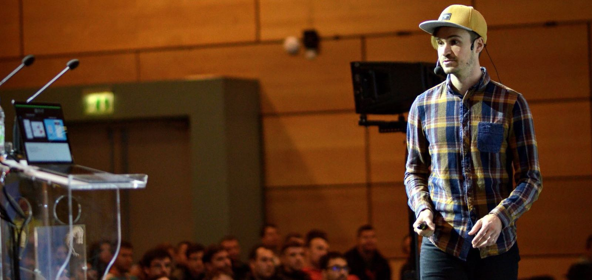

# Christoph Rumpel CV

Hey. I am not a fan of the traditional CVs with all kind of unnecessary information. 👎🏼
This is why I will provide everything you need to know about myself here. What place could make a better fit for a developer than GitHub itself? 😅 For everything else you'd like to know, we can grab a beer or chat :-)

*Note: If you don't like Emojis, this will be hard for you*

## This is me 👨

* **Name**: Christoph Rumpel
* **From**: Austria / Vienna
* **Birthdate**: 12.04.1985
* **E-Mail**: c.rumpel@kabsi.at
* **Blog**: http://christoph-rumpel.com
* **Twitter**: https://twitter.com/christophrumpel
* **GitHub**: https://github.com/christophrumpel

## Work experience 👨‍💻

2013 - 2017 Backend-Developer [Liechtenecker](https://liechtenecker.at)

2012 - 2013 Frontend Freelancer

2011 and 2010 Internships at [LimeSoda](https://www.limesoda.com)

## Open Source work 🤲🏼

* One of the main [contributors](https://github.com/botman/botman/graphs/contributors) of [BotMan](https://botman.io/) (Multiplatform Chatbot PHP library)
* Since 2016 maintainer of [Laravel Twitter Notification Package](https://github.com/laravel-notification-channels/twitter)

## Talks and publications 🗣 🎤

### Blogging 📝

* I do blog about PHP, chatbots and everything inbetween on my personal [blog](http://christoph-rumpel.com)
* I have blogged several years for the [Liechtenecker Blog](https://liechtenecker.at/blog) (German)

### Talks 💬

2016 I started to give meetup talks in Vienna. 2017 I did speak a lot about chatbots, also on several small to medium conferences.
Checkout this [video](https://youtu.be/DbSNTjLszsM) of my last talk in Zagreb / Croatia or my [website](http://christoph-rumpel.com/talks) for more details on my talks.

## Specialization 🧐

Since 2016 I have spent most of my time at Liechtenecker working with chatbots. We are among a view companies who already built several chatbots. Next to Facebook and Slack we also developed custom chatbots for websites.
As I mentioned I also did several talks on my experiences on this topic so far.

### Chatbots I have built 🤖

* [NELA](https://liechtenecker.at/tools/nela/) (FB Messenger)
* [TIM](https://www.messenger.com/t/liechteneckers) (FB Messenger)
* [Klickmal](https://www.klickmal.at/mobilitaet/kfz-versicherung.html) (Website)
* [Wiener Städtische](https://www.wienerstaedtische.at/) (Website)

## Tools I work with every day 🛠

* Git
* PHPUnit
* MySQL
* PHP 5 / 7
* PhpStorm
* Laravel
* JavaScript (Vanilla, VueJS, AngularJS, Gulp, Webpack)
* Digital Ocean
* DialogFlow (NLP)
